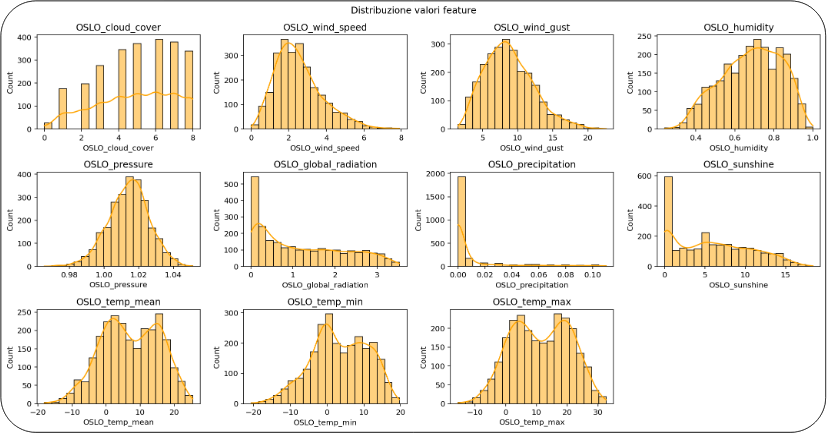

# Numerical Statistics 25 - Weather Dataset analysis



## General

- /scripts/classification.py contains code for EDA and classification
- /scripts/linear_regression.py contains code for linear regression

Please note that linear regression analysis requires a processed (cleaned) dataset. Therefore, it's required to run `classification.py` at least once before executing `linear_regression.py`.

## Report
In the /reports directory there's available:
- **report.pdf** and **report.ipynb**: a detailed report of the analysis
- **project_presentation.pdf**: a general presentation of the project for exam evaluation

## Change city

The dataset contains data for 18 European cities. My analysis was conducted on Oslo, but the code is designed to work with other cities as well. You only need to change the value of the variable `citta` in both scripts. The selected city should have all the weather parameters registered, and among the 18 cities, only the following meet this requirement:

- Budapest
- Dusseldorf
- Maastricht
- Munchen
- Oslo
Feel free to modify the `citta` variable to explore the data for any of these cities.

## Dependencies

Install dependencies with

```bash
pip install -r requirements.txt
```

Eventually you can create a virtual enviroment

```bash
python3 -m venv weather_project
source weather_project/bin/activate
pip install -r requirements.txt
```

To deactivate when you're done

```bash
deactivate
```

## Reference

- Klein Tank, A.M.G. and Coauthors, 2002. Daily dataset of 20th-century surface
  air temperature and precipitation series for the European Climate Assessment.
  Int. J. of Climatol., 22, 1441-1453.
  Data and metadata available at <http://www.ecad.eu>
- Florian Huber, Dafne van Kuppevelt, Peter Steinbach, Colin Sauze, Yang Liu, Berend Weel, "Will the sun shine? – An accessible dataset for teaching machine learning and deep learning", DOI TO BE ADDED!
  Data and metadata available at <https://github.com/florian-huber/weather_prediction_dataset>
- Dataset available on Kaggle at <https://www.kaggle.com/datasets/thedevastator/weather-prediction>
